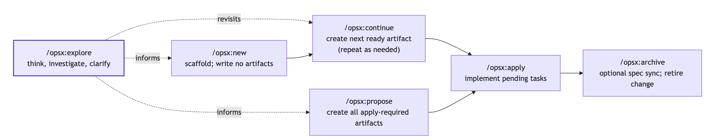

# Spec-Driven Development Workshop

A hands-on introduction to Spec-Driven Development(SDD) with OpenSpec.

## What is Spec-Driven Development?

SDD is the habit of agreeing with your AI agent on **what** to build before any code is written. The agreement lives in your repo as four short artifacts — proposal, spec, design, tasks — that you review like code and archive once the change ships.

**Why not just vibe code?** Vibe coding is fast right up until the agent confidently builds the wrong thing. The intent existed only in a chat window, so there was nothing to review beforehand and nothing to point at afterwards. SDD moves the review to the cheapest possible moment: while the plan is still a paragraph you can rewrite in ten seconds, not a pull request someone has to unpick.

**Isn't that TDD and BDD?** They overlap, but they answer different questions.


| Practice | Answers                                                                |
| -------- | ---------------------------------------------------------------------- |
| TDD      | Does this unit do what its test says?                                  |
| BDD      | Does the system behave the way the business described?                 |
| SDD      | **Why** are we building this, what is in scope, and what becomes true? |


TDD and BDD both assume you already know what to build — they verify it. Neither records why a change exists, where its boundary sits, or which trade-offs were accepted, which is exactly the context an agent needs and the first thing lost in a chat log.

SDD does not replace them. The spec states observable behavior as scenarios; your tests still prove it.

## Prerequisites

- [Cursor](https://cursor.com) or [Claude Code](https://claude.com/claude-code)
- Node.js and npm
- [OpenSpec CLI](https://github.com/Fission-AI/OpenSpec/blob/main/docs/README.md) — `npm install -g @fission-ai/openspec@latest`

## The OPSX lifecycle



Each artifact owns one question and stays out of the others' territory.


| Artifact      | Question it owns                                              |
| ------------- | ------------------------------------------------------------- |
| `proposal.md` | **Why** are we making this change, and where is its boundary? |
| `spec.md`     | **What** observable behavior will become true?                |
| `design.md`   | **How** will we implement the behavior?                       |
| `tasks.md`    | **What work** must be completed and checked?                  |


## Setup

Run once, in your terminal:

```bash
openspec init            # select Claude Code and/or Cursor
openspec config profile  # select all

mkdir -p openspec/schemas
cp openspec-custom/config.yaml openspec/config.yaml
rm -rf openspec/schemas/workshop-compact
cp -R openspec-custom/schemas/workshop-compact openspec/schemas/
```

This installs the workshop's `workshop-compact` schema, which keeps every generated artifact short enough to read live.

## Commands

> **Every `/opsx:`* command in this README is written in Claude Code syntax.**
> Cursor uses a hyphen instead of a colon — run `/opsx-explore`, not `/opsx:explore`.

All `/opsx:*` commands run in your **AI chat**. Only `openspec ...` commands run in your terminal. Mixing these up is the most common stumble.

**Running a command in Cursor**

1. Open the Agent chat with `Cmd + I`, with this repo as your workspace root so Cursor can find `.cursor/commands/`.
2. Type `/` to open the command menu.
3. Type the name without the `opsx:` colon — for example `opsx-explore` — and press Enter.
4. Paste the prompt for that step as your next message.

**Running a command in Claude Code**

Type the command directly in the chat, colon included: `/opsx:explore`.


| Step                    | Claude Code      | Cursor           |
| ----------------------- | ---------------- | ---------------- |
| Think through an idea   | `/opsx:explore`  | `/opsx-explore`  |
| Scaffold a change       | `/opsx:new`      | `/opsx-new`      |
| Draft all artifacts     | `/opsx:propose`  | `/opsx-propose`  |
| Draft the next artifact | `/opsx:continue` | `/opsx-continue` |
| Implement the tasks     | `/opsx:apply`    | `/opsx-apply`    |
| Check work against plan | `/opsx:verify`   | `/opsx-verify`   |
| Retire the change       | `/opsx:archive`  | `/opsx-archive`  |


Resetting context between phases keeps the agent focused:


| Action              | Claude Code | Cursor                                   |
| ------------------- | ----------- | ---------------------------------------- |
| Start fresh         | `/clear`    | New chat (`Cmd + N`)                     |
| Compact the history | `/compact`  | Automatic — no manual command in the IDE |


## Lap 1 — Build the site

Build a product from nothing:

**EXPLORE → PROPOSAL → SPECS → DESIGN → TASKS → APPLY → VERIFY → ARCHIVE**

**Explore.** Run `/opsx:explore`, then paste:

```text
I want to build a small static educational website that helps someone new to
Spec-Driven Development understand how today's SDD tools compare. For each tool
I want to show its flow and the artifacts it produces.

Show the flow visually and the artifacts as a folder structure. For both,
default to one tool at a time, but let me switch to a bird's eye view that lines
the tools up side by side so I can compare them in one place.

When I click a step in a flow, show me a quick explanation of what it does and a
link to that step's specific documentation (not the generic documentation, and
you must verify the content match), and let me dig in further from there. When I
click a file, show me real examples of what it contains, plus a link to its
documentation if it has any.

Focus on OpenSpec, Spec Kit, and Superpowers, and research them. If you find
other SDD tools that look more promising, include them too.
```

Walk through the [Explore command page](https://github.com/Fission-AI/OpenSpec/blob/main/docs/commands.md#opsxexplore) for a step-by-step view of what /opsx:explore does. 

**Plan.** Scaffold the change, then build up the artifacts one at a time:

```text
/opsx:new build-sdd-tool-guide
/opsx:continue   # proposal.md, then a spec per capability
/opsx:continue   # design.md
/opsx:continue   # tasks.md
```

Read each artifact as it appears — that's the point of the workshop.

**Build.** Reset context, then implement:

```text
/compact  (or /clear)
/opsx:apply
```

**See it.** Run `npm run dev` in your terminal.

**Close the loop.** Reset context again, then:

```text
/opsx:verify    # check the build against the plan
/opsx:archive   # retire the change
```

## Lap 2 — Extend a live product

Same loop, now against code that already exists:

**EXPLORE → PROPOSE → REVIEW DELTAS → APPLY → ARCHIVE**

Start a fresh session, run `/opsx:explore`, then paste:

```text
The site already compares SDD tools by their flow and the artifacts they
produce. I think it would also be useful to compare how each tool can be
customized for a team or project.

I have seen that OpenSpec has things like config.yaml and custom schemas, but I
do not know what the equivalent options are in other SDD tools or whether they
are directly comparable. Please research the official documentation and help me
work out a fair and useful way to explain the differences.

I would like users to explore customization for one tool at a time, and also
switch to a side-by-side view. When they select an option, show what it changes,
where it lives, a small example, and a link to the relevant documentation.
```

Then propose, validate, and apply:

```text
/opsx:propose add-customization-comparison
```

```bash
openspec validate
```

```text
/opsx:apply
```

